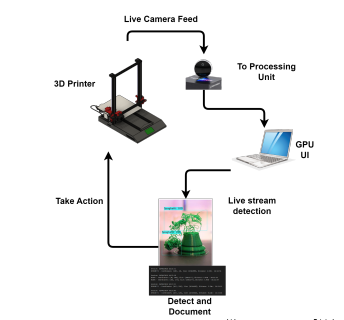

# 3D_Printing_Thesis_code

# Real-Time Vision-Based Fault Detection System for `FDM` 3D Printing

# Data preparation
The images were annotated and the train-test split was set up using tools such as VOTT and Roboflow. Afterwards, a repository utilized CNN (Convolutional Neural Network) machine vision techniques, specifically YOLOv4 Tiny and YOLO V8, to develop a real-time fault detection model designed for FDM (Fused Deposition Modeling) 3D printing applications.

# Data Training
The detection model underwent training on Google Colab, a cloud-based platform, over 35,000 iterations. Training was conducted using the YOLOv4-Tiny architecture implemented in darknet. This process resulted in the generation of configuration (cfg), weights, and name files for the model.

<!-- - Google Collab Training Notebook: https://colab.research.google.com/drive/17oU-cuJcYoama6hatZi_CREhWnAqBPbl?usp=sharing -->

#  Results
- A **lidar** camera was used to test the system in real-time settings.

- After setting up YOLO, the camera feed displays in real-time. Detected faults are marked with bounding boxes showing their respective classes. Simultaneously, detection results are logged into a text file, including session details such as execution date and time.

- 
- 

